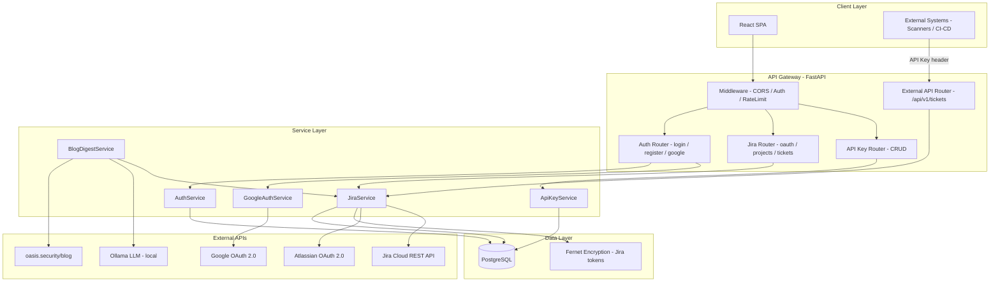
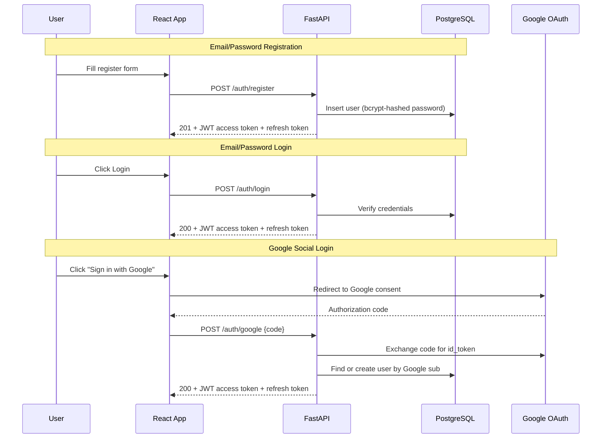
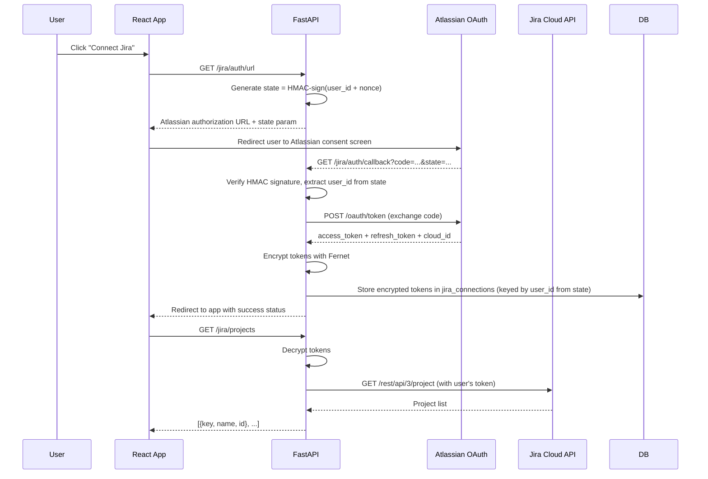
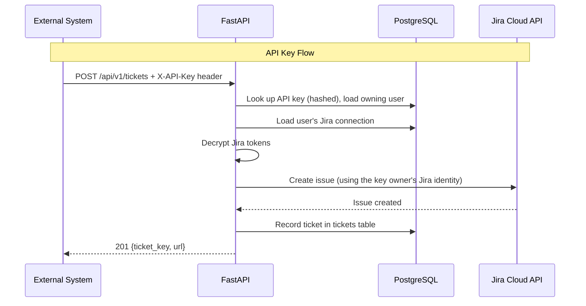

# IdentityHub — Backend High-Level Design

## 1. Overview

IdentityHub is a multi-tenant web application that lets authenticated users report Non-Human Identity (NHI) findings as Jira tickets. Users authenticate via email/password or Google OAuth, connect their personal Jira account via Atlassian OAuth 2.0 (3LO), create tickets in shared Jira projects, and view recent tickets created through the app. An external REST API secured by API keys allows programmatic ticket creation from scanners and CI/CD pipelines.

### 1.1 Key Design Decisions (from Interviewer Clarifications)

| Question | Answer | Impact |
|----------|--------|--------|
| Jira integration | Full OAuth 2.0 (3LO) | Need Atlassian app registration, token refresh flow |
| Multi-tenancy | Shared Jira projects, per-user Jira identity | Users table links to individual Jira credentials |
| REST API keys | App-managed, smart design | Per-user API key generation with CRUD lifecycle |
| External API → Jira routing | Best option (our decision) | API key maps to a user → uses that user's Jira token |
| App auth | Email/password + Google social login | JWT-based sessions, Google OAuth 2.0 integration |
| Issue type field | Include with "Task" default | Form field + API field, default = Task |

---

## 2. Architecture Diagram



---

## 3. Technology Choices

| Concern | Choice | Rationale |
|---------|--------|-----------|
| Framework | **FastAPI** | Async, auto-generated OpenAPI docs, Pydantic validation, dependency injection — ideal for a PoC that needs to look production-grade |
| Database | **PostgreSQL** | Proper relational model for multi-tenancy; runs easily in Docker |
| ORM | **SQLAlchemy 2.0 + Alembic** | Async support, mature migration tooling |
| Auth | **python-jose (JWT)** + **passlib[bcrypt]** | Industry-standard token-based auth |
| Jira tokens at rest | **cryptography.fernet** | Symmetric encryption for OAuth refresh/access tokens |
| HTTP client | **httpx** | Async HTTP client for Jira/Google API calls |
| Task scheduling | **APScheduler** | Lightweight in-process scheduler for the Blog Digest bonus |
| Containerization | **Docker Compose** | Single `docker compose up` for Postgres + backend + frontend |

---

## 4. Backend Folder Structure

```
backend/
├── alembic/                    # DB migrations
│   ├── versions/
│   └── env.py
├── app/
│   ├── __init__.py
│   ├── main.py                 # FastAPI app factory, lifespan, middleware
│   ├── config.py               # Pydantic Settings (env vars)
│   ├── dependencies.py         # Shared FastAPI dependencies (get_db, get_current_user)
│   │
│   ├── auth/                   # Auth domain
│   │   ├── __init__.py
│   │   ├── router.py           # POST /auth/register, /auth/login, /auth/google, /auth/refresh, /auth/logout + GET /auth/me
│   │   ├── service.py          # AuthService, GoogleAuthService
│   │   ├── schemas.py          # Pydantic request/response models
│   │   └── utils.py            # JWT creation/verification, password hashing
│   │
│   ├── jira/                   # Jira domain
│   │   ├── __init__.py
│   │   ├── router.py           # Jira OAuth + ticket + project endpoints
│   │   ├── service.py          # JiraService (OAuth flow, API calls, token refresh)
│   │   ├── schemas.py          # Pydantic models for Jira payloads
│   │   └── encryption.py       # Fernet encrypt/decrypt for tokens
│   │
│   ├── api_keys/               # API key management domain
│   │   ├── __init__.py
│   │   ├── router.py           # CRUD for API keys
│   │   ├── service.py          # ApiKeyService (generate, validate, revoke)
│   │   └── schemas.py
│   │
│   ├── external/               # External-facing REST API (scanner/CI-CD)
│   │   ├── __init__.py
│   │   ├── router.py           # POST /api/v1/tickets
│   │   └── schemas.py
│   │
│   ├── blog_digest/            # Bonus: NHI Blog Digest automation
│   │   ├── __init__.py
│   │   ├── scheduler.py        # APScheduler job definition
│   │   ├── service.py          # Scrape blog, call Ollama LLM, create Jira ticket
│   │   └── schemas.py
│   │
│   └── models/                 # SQLAlchemy models (shared across domains)
│       ├── __init__.py
│       ├── user.py
│       ├── jira_connection.py
│       ├── ticket.py
│       └── api_key.py
│
├── tests/
│   ├── conftest.py
│   ├── test_auth.py
│   ├── test_jira.py
│   ├── test_api_keys.py
│   └── test_external.py
│
├── alembic.ini
├── requirements.txt
├── Dockerfile
└── .env.example
```

### 4.1 Layer Responsibilities

| Layer | Responsibility | Rule |
|-------|---------------|------|
| **Router** | HTTP concerns only — parse request, call service, format response | No business logic, no direct DB access |
| **Service** | Business logic, orchestration, external API calls | No HTTP concerns (no Request/Response objects) |
| **Model** | Database schema definition, relationships | No logic beyond property helpers |
| **Schema** | Request/response validation and serialization | Pydantic models, no side effects |
| **Dependencies** | Cross-cutting concerns (auth, DB session) | Injected via FastAPI's `Depends()` |

---

## 5. Authentication & Authorization Flows

### 5.1 App Authentication



**Token strategy:**
- **Access token**: short-lived (15 min), sent in `Authorization: Bearer <token>` header.
- **Refresh token**: long-lived (7 days), stored in HttpOnly cookie, used to obtain new access tokens via `POST /auth/refresh`.

### 5.2 Jira OAuth 2.0 (3LO) Flow



**Identifying the user on callback**: The Jira OAuth callback is a browser redirect from Atlassian -- there is no `Authorization` header. To identify which user initiated the flow, the backend encodes the `user_id` and a random nonce into the OAuth `state` parameter using HMAC signing (`SECRET_KEY`). On callback, the backend verifies the HMAC signature and extracts the `user_id` from `state`. This is the canonical OAuth solution and also provides CSRF protection.

**Token refresh**: When a Jira API call returns 401, the service automatically uses the refresh token to obtain a new access token, encrypts and persists it, then retries the original request (single retry).

### 5.3 External API Key Authentication



**Design decision — External API → Jira routing**: Each API key belongs to a user. When an external system creates a ticket via API key, the ticket is created under that user's Jira identity. This is the cleanest multi-tenancy model: the key owner is accountable for all tickets created with their key.

---

## 6. API Contract

### 6.1 Base URL & Conventions

- Base: `http://localhost:8000`
- All endpoints return JSON.
- Errors follow a consistent envelope: `{"detail": "Human-readable message", "code": "MACHINE_CODE"}`.
- Dates are ISO 8601 UTC.
- Pagination uses `?limit=N&offset=M` where applicable.

### 6.2 Auth Endpoints

#### `POST /auth/register`

Create a new user account.

**Request:**
```json
{
  "email": "user@example.com",
  "password": "SecureP@ss1",
  "full_name": "Avi Simson"
}
```

**Response (201):**
```json
{
  "access_token": "eyJ...",
  "token_type": "bearer",
  "user": {
    "id": "uuid",
    "email": "user@example.com",
    "full_name": "Avi Simson",
    "auth_provider": "local"
  }
}
```

**Errors:**
| Code | Body | Condition |
|------|------|-----------|
| 409 | `{"detail": "Email already registered", "code": "EMAIL_EXISTS"}` | Duplicate email |
| 422 | `{"detail": [...], "code": "VALIDATION_ERROR"}` | Invalid input |

---

#### `POST /auth/login`

Authenticate with email and password.

**Request:**
```json
{
  "email": "user@example.com",
  "password": "SecureP@ss1"
}
```

**Response (200):** Same shape as register response.

**Errors:**
| Code | Body | Condition |
|------|------|-----------|
| 401 | `{"detail": "Invalid email or password", "code": "INVALID_CREDENTIALS"}` | Wrong credentials |

---

#### `POST /auth/google`

Exchange a Google authorization code for a session.

**Request:**
```json
{
  "code": "4/0AX4XfW...",
  "redirect_uri": "http://localhost:3000/auth/google/callback"
}
```

**Response (200):** Same shape as register response, `auth_provider` = `"google"`.

---

#### `POST /auth/refresh`

Obtain a new access token using the refresh token (sent via HttpOnly cookie). Returns the full user object so the frontend can restore session state after a page reload.

**Response (200):**
```json
{
  "access_token": "eyJ...",
  "token_type": "bearer",
  "user": {
    "id": "uuid",
    "email": "user@example.com",
    "full_name": "Avi Simson",
    "auth_provider": "local"
  }
}
```

**Errors:**
| Code | Body | Condition |
|------|------|-----------|
| 401 | `{"detail": "Invalid or expired refresh token", "code": "INVALID_REFRESH_TOKEN"}` | Missing/expired/invalid cookie |

---

#### `GET /auth/me`

Return the current authenticated user's profile. Requires `Authorization: Bearer <access_token>`.

**Response (200):**
```json
{
  "id": "uuid",
  "email": "user@example.com",
  "full_name": "Avi Simson",
  "auth_provider": "local"
}
```

**Errors:**
| Code | Body | Condition |
|------|------|-----------|
| 401 | `{"detail": "Not authenticated", "code": "NOT_AUTHENTICATED"}` | Missing/invalid token |

---

#### `POST /auth/logout`

Invalidate the refresh token cookie.

**Response (200):**
```json
{
  "detail": "Logged out successfully"
}
```

---

### 6.3 Jira Integration Endpoints

All endpoints below require `Authorization: Bearer <access_token>`.

#### `GET /jira/auth/url`

Get the Atlassian OAuth authorization URL.

**Response (200):**
```json
{
  "authorization_url": "https://auth.atlassian.com/authorize?...",
  "state": "random-csrf-state"
}
```

---

#### `GET /jira/auth/callback?code=...&state=...`

OAuth callback — exchanges the code for tokens and stores the Jira connection. This endpoint is called by Atlassian's redirect; it ultimately redirects the user's browser back to the React app.

**Response:** `302 Redirect` → `http://localhost:3000/jira/connected?status=success`

**Errors:** Redirects with `?status=error&message=...` on failure.

---

#### `GET /jira/status`

Check if the current user has a connected Jira account. Always returns 200 -- the `connected` boolean distinguishes the two states. This avoids TanStack Query treating "not connected" as an error.

**Response (200) — connected:**
```json
{
  "connected": true,
  "cloud_id": "abc-123",
  "jira_site_url": "https://yoursite.atlassian.net"
}
```

**Response (200) — not connected:**
```json
{
  "connected": false
}
```

---

#### `DELETE /jira/connection`

Disconnect the user's Jira account (revokes tokens, deletes row).

**Response (200):**
```json
{
  "detail": "Jira connection removed"
}
```

---

#### `GET /jira/projects`

List accessible Jira projects for the connected user.

**Response (200):**
```json
{
  "projects": [
    {
      "id": "10001",
      "key": "SEC",
      "name": "Security Findings",
      "avatar_url": "https://..."
    }
  ]
}
```

**Errors:**
| Code | Body | Condition |
|------|------|-----------|
| 403 | `{"detail": "Jira not connected", "code": "JIRA_NOT_CONNECTED"}` | No Jira connection for user |

---

#### `GET /jira/projects/{project_key}/issue-types`

List available issue types for a project.

**Response (200):**
```json
{
  "issue_types": [
    {"id": "10001", "name": "Task", "is_default": true},
    {"id": "10002", "name": "Bug", "is_default": false},
    {"id": "10003", "name": "Story", "is_default": false}
  ]
}
```

---

#### `POST /jira/tickets`

Create a Jira ticket (NHI finding).

**Request:**
```json
{
  "project_key": "SEC",
  "summary": "Stale Service Account: svc-deploy-prod",
  "description": "This service account has not been used in 90 days...",
  "issue_type": "Task"
}
```

**Response (201):**
```json
{
  "id": "uuid",
  "jira_ticket_key": "SEC-42",
  "jira_ticket_url": "https://yoursite.atlassian.net/browse/SEC-42",
  "summary": "Stale Service Account: svc-deploy-prod",
  "issue_type": "Task",
  "source": "ui",
  "created_at": "2026-04-07T14:30:00Z",
  "created_by": {
    "id": "uuid",
    "full_name": "Avi Simson"
  }
}
```

> **Note:** The response shape matches `GET /jira/tickets` exactly, enabling optimistic cache prepend on the frontend without shape mismatches. The `source` field is set by the backend based on the calling context (`ui`, `api`, or `blog_digest`).

**Errors:**
| Code | Body | Condition |
|------|------|-----------|
| 403 | `{"detail": "Jira not connected", "code": "JIRA_NOT_CONNECTED"}` | No connection |
| 400 | `{"detail": "Project SEC not found", "code": "JIRA_PROJECT_NOT_FOUND"}` | Invalid project key |
| 502 | `{"detail": "Jira API error: ...", "code": "JIRA_API_ERROR"}` | Upstream Jira failure |

---

#### `GET /jira/tickets?project_key=SEC&limit=10`

Get the 10 most recent tickets created via this app for a given project.

**Query params:**
| Param | Type | Default | Description |
|-------|------|---------|-------------|
| `project_key` | string | required | Jira project key |
| `limit` | int | 10 | Max tickets to return (capped at 50) |

**Response (200):**
```json
{
  "tickets": [
    {
      "id": "uuid",
      "jira_ticket_key": "SEC-42",
      "jira_ticket_url": "https://yoursite.atlassian.net/browse/SEC-42",
      "summary": "Stale Service Account: svc-deploy-prod",
      "issue_type": "Task",
      "source": "ui",
      "created_at": "2026-04-07T14:30:00Z",
      "created_by": {
        "id": "uuid",
        "full_name": "Avi Simson"
      }
    }
  ]
}
```

**Note:** This queries the local `tickets` table (not Jira) filtered by `project_key` and ordered by `created_at DESC`. Since Jira projects are shared, all users see all tickets for a project that were created through this app. The `source` field indicates how each ticket was created (`ui`, `api`, or `blog_digest`).

---

### 6.4 API Key Management Endpoints

All endpoints require `Authorization: Bearer <access_token>`.

#### `POST /api-keys`

Generate a new API key for the current user.

**Request:**
```json
{
  "name": "CI Pipeline Scanner"
}
```

**Response (201):**
```json
{
  "id": "uuid",
  "name": "CI Pipeline Scanner",
  "key": "ihub_live_a1b2c3d4e5f6...",
  "created_at": "2026-04-07T14:30:00Z"
}
```

> **Important:** The raw `key` is returned only once at creation time. The backend stores a SHA-256 hash.

---

#### `GET /api-keys`

List the current user's API keys (key values are masked).

**Response (200):**
```json
{
  "api_keys": [
    {
      "id": "uuid",
      "name": "CI Pipeline Scanner",
      "key_prefix": "ihub_live_a1b2....",
      "created_at": "2026-04-07T14:30:00Z",
      "last_used_at": "2026-04-07T15:00:00Z"
    }
  ]
}
```

---

#### `DELETE /api-keys/{key_id}`

Revoke an API key. This performs a soft-delete by setting `is_active = false` rather than removing the row, preserving an audit trail.

**Response (200):**
```json
{
  "detail": "API key revoked"
}
```

---

### 6.5 External API Endpoint

This is the programmatic endpoint for external systems.

#### `POST /api/v1/tickets`

**Headers:**
```
X-API-Key: ihub_live_a1b2c3d4e5f6...
Content-Type: application/json
```

**Request:**
```json
{
  "project_key": "SEC",
  "summary": "Overprivileged Key Detected: aws-lambda-prod",
  "description": "Key has admin access but only needs S3 read...",
  "issue_type": "Task"
}
```

**Response (201):**
```json
{
  "jira_ticket_key": "SEC-43",
  "jira_ticket_url": "https://yoursite.atlassian.net/browse/SEC-43",
  "summary": "Overprivileged Key Detected: aws-lambda-prod",
  "created_at": "2026-04-07T14:30:00Z"
}
```

**Errors:**
| Code | Body | Condition |
|------|------|-----------|
| 401 | `{"detail": "Invalid or missing API key", "code": "INVALID_API_KEY"}` | Bad/missing key |
| 401 | `{"detail": "This API key has been revoked", "code": "API_KEY_REVOKED"}` | Key exists but `is_active = false` |
| 403 | `{"detail": "API key owner has no Jira connection", "code": "JIRA_NOT_CONNECTED"}` | Key owner hasn't connected Jira |
| 422 | `{"detail": [...], "code": "VALIDATION_ERROR"}` | Pydantic validation failure |
| 429 | `{"detail": "Rate limit exceeded. Try again later.", "code": "RATE_LIMITED"}` | slowapi rate limit hit |
| 502 | `{"detail": "Jira API error: ...", "code": "JIRA_API_ERROR"}` | Upstream failure |

---

### 6.6 Health Endpoint

#### `GET /health`

**Response (200):**
```json
{
  "status": "healthy",
  "version": "1.0.0",
  "database": "connected"
}
```

---

## 7. Security Design

| Concern | Approach |
|---------|----------|
| **Passwords** | Bcrypt via `passlib` with salt rounds = 12 |
| **JWT signing** | HS256 with a strong random `SECRET_KEY` from env |
| **Jira tokens at rest** | Fernet symmetric encryption; key from env `JIRA_ENCRYPTION_KEY` |
| **API keys at rest** | SHA-256 hashed; raw key shown only once at creation |
| **CSRF (OAuth callbacks)** | `state` parameter validated on Jira and Google callbacks |
| **CORS** | Restrict to frontend origin only |
| **Rate limiting** | `slowapi` — 60 req/min per user on authenticated endpoints; 20 req/min per key on external API |
| **Input validation** | Pydantic models on every endpoint; max length constraints on summary (255) and description (32k) |
| **SQL injection** | SQLAlchemy parameterized queries (never raw SQL) |
| **Secrets in env** | `.env` file excluded from VCS; `.env.example` provided |

---

## 8. Error Handling Strategy

All errors return a consistent JSON envelope:

```json
{
  "detail": "Human-readable message shown to the user",
  "code": "MACHINE_READABLE_CODE"
}
```

A global exception handler catches:
- **Pydantic `ValidationError`** → 422 with field-level details.
- **`JiraApiError`** (custom) → 502 with the upstream error message.
- **`JiraNotConnectedError`** (custom) → 403.
- **`AuthenticationError`** (custom) → 401.
- **`RateLimitExceeded`** (slowapi) → 429 with `RATE_LIMITED` code.
- **Unhandled exceptions** → 500 with generic message (details logged, not exposed).

---

## 9. Bonus: NHI Blog Digest

An APScheduler background job runs on a configurable cron (default: daily at 09:00 UTC).

**Flow:**
1. Scrape `https://oasis.security/blog` for the most recent post URL and title.
2. Fetch the post content and extract the main text.
3. Send the text to **Ollama** (local LLM) with a prompt to produce a concise summary. Ollama exposes an OpenAI-compatible API, so the `openai` Python client is used with:
   - `LLM_BASE_URL` — Ollama API endpoint (default: `http://localhost:11434/v1`).
   - `LLM_MODEL` — model to use (default: `llama3.2`).
4. Use a designated "system" user's Jira connection to create a ticket:
   - **Project**: configurable via `BLOG_DIGEST_PROJECT_KEY` env var.
   - **Summary**: `[NHI Blog Digest] {blog post title}`
   - **Description**: AI-generated summary + link to original post.
   - **Issue type**: Task.

The system user is a regular app user whose credentials are configured via env vars (`BLOG_DIGEST_USER_EMAIL`). This avoids creating a special auth bypass.

---

## 10. API Documentation (Swagger / OpenAPI)

FastAPI generates interactive API documentation automatically from Pydantic schemas, route decorators, and docstrings. No additional configuration is needed.

### 10.1 Available Documentation UIs

| URL | UI | Purpose |
|-----|----|---------|
| `http://localhost:8000/docs` | **Swagger UI** | Interactive API explorer with "Try it out" capability. Testers and frontend devs can execute requests directly. |
| `http://localhost:8000/redoc` | **ReDoc** | Read-only documentation with a polished layout. Suitable for sharing with stakeholders. |
| `http://localhost:8000/openapi.json` | **Raw OpenAPI spec** | Machine-readable JSON spec. Can be imported into Postman, Insomnia, or used to generate client SDKs. |

### 10.2 Swagger Configuration

```python
app = FastAPI(
    title="IdentityHub API",
    description="NHI finding management platform with Jira integration",
    version="1.0.0",
    docs_url="/docs",
    redoc_url="/redoc",
)
```

All endpoints are organized into **tags** for clear grouping in the Swagger UI:

| Tag | Endpoints | Description |
|-----|-----------|-------------|
| `Auth` | `/auth/register`, `/auth/login`, `/auth/google`, `/auth/refresh`, `/auth/me`, `/auth/logout` | User authentication and session management |
| `Jira` | `/jira/auth/url`, `/jira/auth/callback`, `/jira/status`, `/jira/connection`, `/jira/projects`, `/jira/projects/{key}/issue-types`, `/jira/tickets` | Jira OAuth, project browsing, ticket creation |
| `API Keys` | `/api-keys` (GET, POST), `/api-keys/{key_id}` (DELETE) | API key lifecycle management |
| `External API` | `/api/v1/tickets` | Programmatic ticket creation for scanners/CI-CD |
| `Health` | `/health` | Service health check |

### 10.3 Testing the External API in Swagger

The external API (`POST /api/v1/tickets`) uses `X-API-Key` header authentication, which is distinct from the JWT Bearer auth used by the rest of the API. Swagger UI supports this via the "Authorize" button:

```python
external_api_key_scheme = APIKeyHeader(name="X-API-Key", auto_error=False)
```

Testers can:
1. Open `http://localhost:8000/docs`
2. Click **Authorize**
3. Enter their API key in the `X-API-Key` field
4. Use **Try it out** on `POST /api/v1/tickets` to create tickets programmatically

### 10.4 Example: Generating a Postman Collection

```bash
curl http://localhost:8000/openapi.json -o openapi.json
# Import openapi.json into Postman via File > Import
```

---

## 11. Deployment & DevEx

```yaml
# docker-compose.yml (simplified)
services:
  db:
    image: postgres:16-alpine
    environment:
      POSTGRES_DB: identityhub
      POSTGRES_USER: ihub
      POSTGRES_PASSWORD: ${DB_PASSWORD}
    ports: ["5432:5432"]
    volumes: [pgdata:/var/lib/postgresql/data]

  backend:
    build: ./backend
    ports: ["8000:8000"]
    depends_on: [db]
    env_file: .env

  frontend:
    build: ./frontend
    ports: ["3000:3000"]
    depends_on: [backend]
```

**Single command startup:** `docker compose up --build`

**Dev workflow:**
1. `cp .env.example .env` and fill in secrets.
2. `docker compose up` — Postgres, backend, and frontend all start.
3. Alembic migrations run automatically on backend startup.
4. FastAPI Swagger UI available at `http://localhost:8000/docs` (see Section 10).
