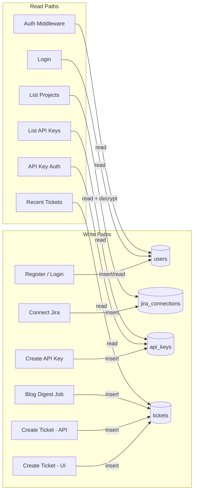

# IdentityHub — Database Design Document

## 1. Overview

PostgreSQL is the single source of truth for user accounts, Jira connections, API keys, and ticket records. This document covers the schema design, entity relationships, indexing strategy, encryption approach, and migration workflow.

**Engine:** PostgreSQL 16  
**ORM:** SQLAlchemy 2.0 (async)  
**Migrations:** Alembic  

---

## 2. Entity-Relationship Diagram

```mermaid
erDiagram
    users ||--o| jira_connections : "has one"
    users ||--o{ api_keys : "owns many"
    users ||--o{ tickets : "creates many"
    jira_connections ||--o{ tickets : "used to create"

    users {
        uuid id PK
        varchar email UK
        varchar password_hash "nullable - null for Google-only users"
        varchar full_name
        varchar auth_provider "local | google"
        varchar google_sub "nullable UK - Google subject ID"
        timestamp created_at
        timestamp updated_at
    }

    jira_connections {
        uuid id PK
        uuid user_id FK UK
        varchar cloud_id "Atlassian cloud instance ID"
        varchar site_url "e.g. yoursite.atlassian.net"
        bytea access_token_enc "Fernet-encrypted"
        bytea refresh_token_enc "Fernet-encrypted"
        timestamp token_expires_at
        timestamp created_at
        timestamp updated_at
    }

    api_keys {
        uuid id PK
        uuid user_id FK
        varchar name "human-friendly label"
        varchar key_hash "SHA-256 of the raw key"
        varchar key_prefix "first 12 chars for display"
        boolean is_active "default true - false when revoked"
        timestamp last_used_at "nullable"
        timestamp created_at
    }

    tickets {
        uuid id PK
        uuid user_id FK
        uuid jira_connection_id FK
        varchar jira_ticket_key "e.g. SEC-42"
        varchar jira_ticket_url
        varchar project_key
        varchar summary
        text description
        varchar issue_type "Task, Bug, Story, etc."
        varchar source "ui | api | blog_digest"
        timestamp created_at
    }
```

---

## 3. Table Definitions

### 3.1 `users`

Stores all registered accounts — both local (email/password) and Google OAuth users.

| Column | Type | Constraints | Notes |
|--------|------|-------------|-------|
| `id` | `UUID` | PK, default `gen_random_uuid()` | |
| `email` | `VARCHAR(255)` | UNIQUE, NOT NULL | Normalized to lowercase |
| `password_hash` | `VARCHAR(255)` | NULLABLE | NULL for Google-only users |
| `full_name` | `VARCHAR(255)` | NOT NULL | |
| `auth_provider` | `VARCHAR(20)` | NOT NULL, default `'local'` | `local` or `google` |
| `google_sub` | `VARCHAR(255)` | UNIQUE, NULLABLE | Google's stable user ID |
| `created_at` | `TIMESTAMPTZ` | NOT NULL, default `now()` | |
| `updated_at` | `TIMESTAMPTZ` | NOT NULL, default `now()` | Auto-updated via trigger |

**Indexes:**
- `ix_users_email` — UNIQUE on `email` (login lookup)
- `ix_users_google_sub` — UNIQUE on `google_sub` WHERE NOT NULL (Google login lookup)

**Design notes:**
- A user who registers locally and later signs in with Google (same email) will have their account linked: `google_sub` is set, `auth_provider` stays `local` (they can use either method).
- `password_hash` is NULL-able because Google-only users never set a password.

---

### 3.2 `jira_connections`

One-to-one relationship with `users`. Stores encrypted Atlassian OAuth tokens.

| Column | Type | Constraints | Notes |
|--------|------|-------------|-------|
| `id` | `UUID` | PK | |
| `user_id` | `UUID` | FK → `users.id`, UNIQUE, NOT NULL | One connection per user |
| `cloud_id` | `VARCHAR(255)` | NOT NULL | Identifies the Atlassian cloud instance |
| `site_url` | `VARCHAR(255)` | NOT NULL | e.g. `https://yoursite.atlassian.net` |
| `access_token_enc` | `BYTEA` | NOT NULL | Fernet-encrypted access token |
| `refresh_token_enc` | `BYTEA` | NOT NULL | Fernet-encrypted refresh token |
| `token_expires_at` | `TIMESTAMPTZ` | NOT NULL | When the access token expires |
| `created_at` | `TIMESTAMPTZ` | NOT NULL, default `now()` | |
| `updated_at` | `TIMESTAMPTZ` | NOT NULL, default `now()` | Updated on token refresh |

**Indexes:**
- `ix_jira_connections_user_id` — UNIQUE on `user_id`

**Encryption details:**
- `access_token_enc` and `refresh_token_enc` are encrypted with Fernet (`cryptography` library).
- The Fernet key is derived from the `JIRA_ENCRYPTION_KEY` environment variable.
- Tokens are decrypted in-memory only when making Jira API calls; they are never logged or returned to the client.

---

### 3.3 `api_keys`

Per-user API keys for the external REST endpoint. A user can have multiple keys.

| Column | Type | Constraints | Notes |
|--------|------|-------------|-------|
| `id` | `UUID` | PK | |
| `user_id` | `UUID` | FK → `users.id`, NOT NULL | Key owner |
| `name` | `VARCHAR(100)` | NOT NULL | User-provided label |
| `key_hash` | `VARCHAR(64)` | UNIQUE, NOT NULL | SHA-256 hex digest |
| `key_prefix` | `VARCHAR(16)` | NOT NULL | First 12 chars for UI display |
| `is_active` | `BOOLEAN` | NOT NULL, default `true` | Set to `false` on revocation (soft-delete) |
| `last_used_at` | `TIMESTAMPTZ` | NULLABLE | Updated on each API call |
| `created_at` | `TIMESTAMPTZ` | NOT NULL, default `now()` | |

**Indexes:**
- `ix_api_keys_key_hash` — UNIQUE on `key_hash` (lookup during API auth)
- `ix_api_keys_user_id` — on `user_id` (list user's keys)

**Security model:**
- On creation, a raw key is generated as `ihub_live_` + 48 random hex chars.
- The raw key is returned to the user **exactly once** in the creation response.
- Only the SHA-256 hash is stored. Authentication compares `sha256(provided_key)` against `key_hash`.
- The `key_prefix` (first 12 chars including `ihub_live_`) allows users to identify keys in the UI without exposing the full value.

**Soft-delete on revocation:**
- `DELETE /api-keys/{key_id}` sets `is_active = false` instead of removing the row.
- The external API auth checks `is_active`: if the key exists but is revoked, it returns `API_KEY_REVOKED` (distinct from `INVALID_API_KEY`), giving external system operators a clear signal.
- `GET /api-keys` only returns keys where `is_active = true`.
- The soft-delete preserves an audit trail of previously issued keys.

---

### 3.4 `tickets`

Local record of every Jira ticket created through this app (UI, API, or blog digest).

| Column | Type | Constraints | Notes |
|--------|------|-------------|-------|
| `id` | `UUID` | PK | |
| `user_id` | `UUID` | FK → `users.id`, NOT NULL | Who created it |
| `jira_connection_id` | `UUID` | FK → `jira_connections.id`, NOT NULL | Which Jira connection was used |
| `jira_ticket_key` | `VARCHAR(50)` | NOT NULL | e.g. `SEC-42` |
| `jira_ticket_url` | `VARCHAR(500)` | NOT NULL | Full browse URL |
| `project_key` | `VARCHAR(20)` | NOT NULL | e.g. `SEC` |
| `summary` | `VARCHAR(255)` | NOT NULL | Ticket title |
| `description` | `TEXT` | NULLABLE | Ticket description body |
| `issue_type` | `VARCHAR(50)` | NOT NULL, default `'Task'` | Jira issue type name |
| `source` | `VARCHAR(20)` | NOT NULL | `ui`, `api`, or `blog_digest` |
| `created_at` | `TIMESTAMPTZ` | NOT NULL, default `now()` | |

**Indexes:**
- `ix_tickets_project_key_created` — composite on `(project_key, created_at DESC)` — powers the "recent 10 tickets" query
- `ix_tickets_user_id` — on `user_id`

**Query pattern — Recent tickets view:**
```sql
SELECT t.*, u.full_name
FROM tickets t
JOIN users u ON u.id = t.user_id
WHERE t.project_key = :project_key
ORDER BY t.created_at DESC
LIMIT 10;
```

This query is served entirely by the composite index on `(project_key, created_at DESC)`.

---

## 4. Data Flow Summary



---

## 5. Encryption at Rest

### 5.1 Jira Tokens — Fernet Encryption

```
JIRA_ENCRYPTION_KEY (env var, base64-encoded 32 bytes)
        │
        ▼
┌─────────────────────────┐
│   Fernet(key)           │
│   .encrypt(token)  ──►  │  access_token_enc (BYTEA in DB)
│   .decrypt(enc)    ◄──  │  raw token (used in API call, never persisted)
└─────────────────────────┘
```

- **Why Fernet?** Provides authenticated encryption (AES-128-CBC + HMAC-SHA256). Prevents tampering and ensures confidentiality.
- **Key rotation**: Generate the key once on initial setup. To rotate, decrypt all tokens with the old key, re-encrypt with the new key in a migration script.

### 5.2 API Keys — One-Way Hashing

```
Raw key: ihub_live_a1b2c3d4e5f6...
        │
        ├──► SHA-256 hash ──► stored in key_hash column
        └──► first 12 chars ──► stored in key_prefix column
```

- The raw key cannot be recovered from the hash.
- `key_prefix` is for display only ("Which key is this?").

### 5.3 Passwords — Bcrypt

```
Raw password ──► bcrypt(password, rounds=12) ──► password_hash column
```

- Bcrypt includes a per-user salt automatically.
- Verification: `bcrypt.verify(candidate, stored_hash)`.

---

## 6. Migration Strategy

### 6.1 Alembic Configuration

```
backend/
├── alembic/
│   ├── env.py          # Reads DB URL from app config
│   ├── script.py.mako  # Template for new migrations
│   └── versions/
│       ├── 001_initial_schema.py
│       └── ...
├── alembic.ini
```

### 6.2 Migration Workflow

1. **Auto-generate**: `alembic revision --autogenerate -m "description"` — compares SQLAlchemy models to current DB state.
2. **Review**: Always review auto-generated migrations for correctness.
3. **Apply**: `alembic upgrade head` — runs on backend startup in Docker.
4. **Rollback**: `alembic downgrade -1` — each migration includes a `downgrade()` function.

### 6.3 Initial Migration

The first migration creates all four tables, indexes, and sets up the `updated_at` trigger:

```sql
CREATE OR REPLACE FUNCTION update_updated_at()
RETURNS TRIGGER AS $$
BEGIN
    NEW.updated_at = now();
    RETURN NEW;
END;
$$ LANGUAGE plpgsql;

CREATE TRIGGER set_updated_at
    BEFORE UPDATE ON users
    FOR EACH ROW EXECUTE FUNCTION update_updated_at();

CREATE TRIGGER set_updated_at
    BEFORE UPDATE ON jira_connections
    FOR EACH ROW EXECUTE FUNCTION update_updated_at();
```

---

## 7. Capacity & Scaling Notes

For a PoC, the current design handles everything in a single Postgres instance. Observations for future scaling:

| Concern | Current | Future |
|---------|---------|--------|
| Connection pooling | SQLAlchemy async pool (default 5 connections) | PgBouncer in front of Postgres |
| Ticket volume | Composite index on `(project_key, created_at)` handles the "recent 10" query efficiently | Partition `tickets` table by `created_at` if volume grows significantly |
| Token encryption | Single Fernet key | AWS KMS / HashiCorp Vault for key management |
| API key lookup | SHA-256 hash index is O(1) | No change needed — hash lookups scale well |
| Multi-region | N/A for PoC | Read replicas + connection routing |
