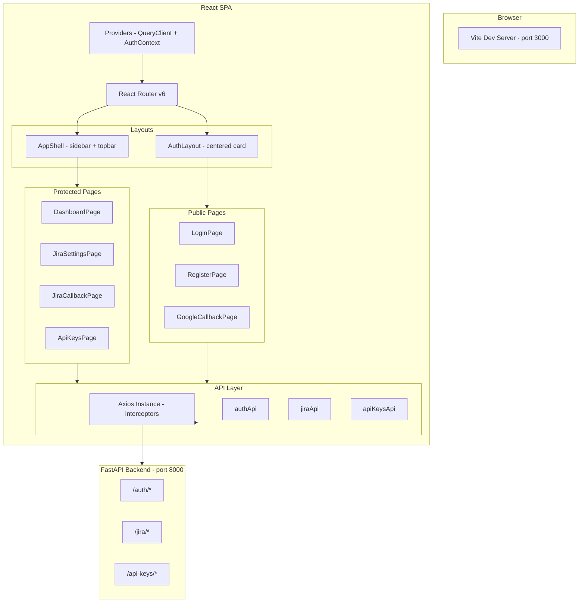
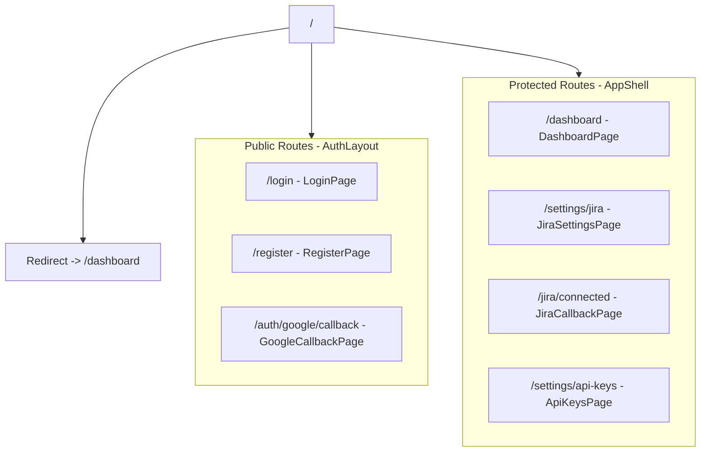
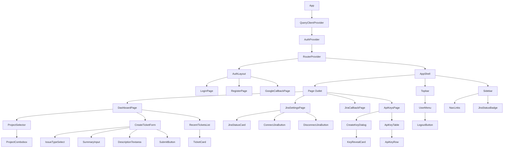
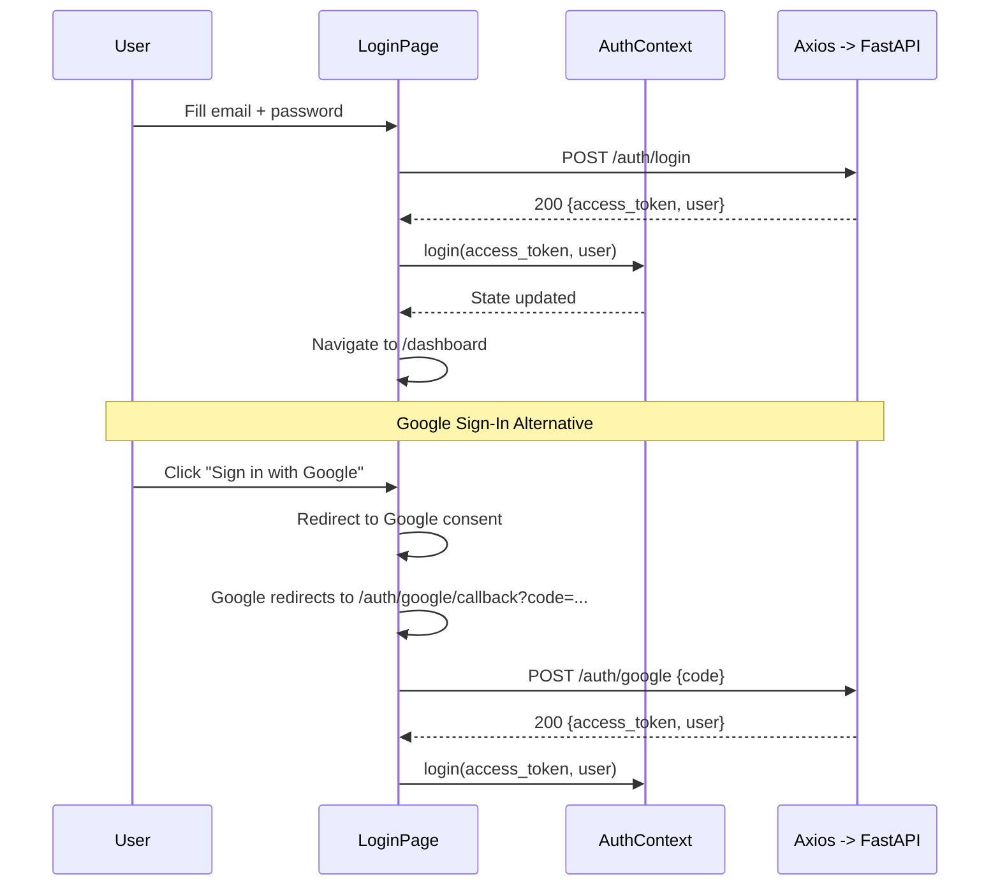
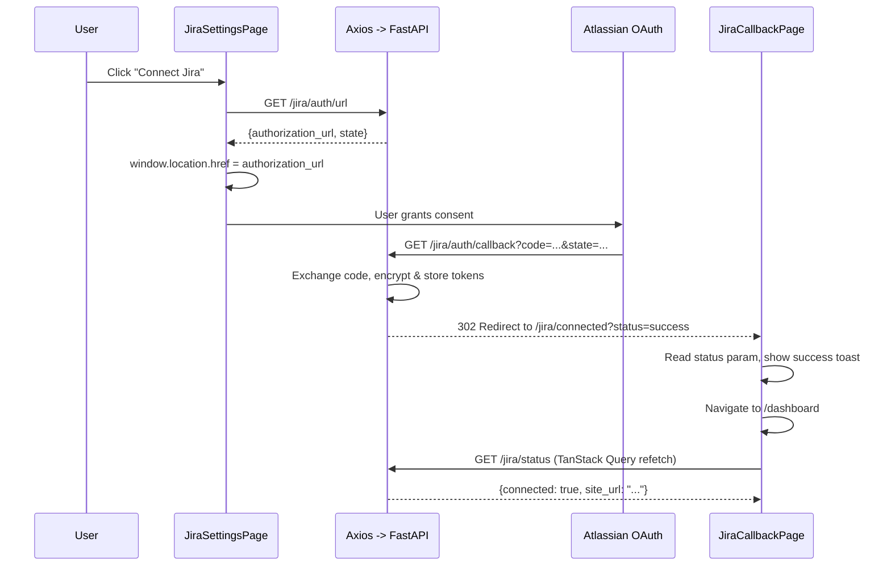
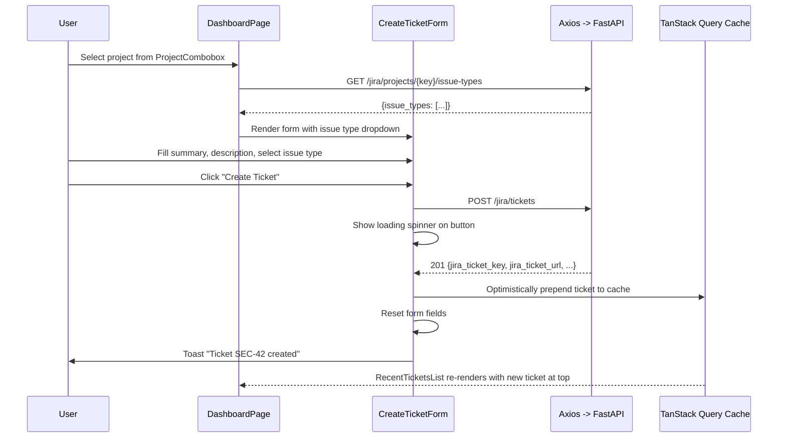
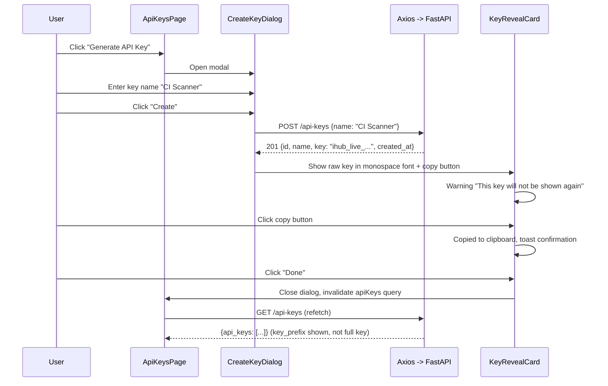

# IdentityHub — Frontend High-Level Design

## 1. Overview

The IdentityHub frontend is a single-page application (SPA) built with React, TypeScript, and Vite. It provides authenticated users with a dashboard to connect their Jira account, create NHI finding tickets, view recent tickets, and manage API keys for programmatic access.

### 1.1 Technology Choices

| Concern | Choice | Rationale |
|---------|--------|-----------|
| Build tool | **Vite** | Sub-second HMR, native ESM, zero-config TypeScript |
| Language | **TypeScript** | Type safety across components, hooks, and API layer |
| Routing | **React Router v6** | Nested layouts, loaders, protected route patterns |
| Server state | **TanStack Query v5** | Caching, background refetch, optimistic updates, retry logic |
| Client state | **React Context** | Auth state only — minimal surface, no Redux overhead |
| HTTP client | **Axios** | Interceptors for auth headers and token refresh |
| UI components | **shadcn/ui** | Radix primitives + Tailwind — copy-paste ownership, accessible, no runtime dep |
| Styling | **Tailwind CSS v3** | Utility-first, consistent design tokens, purged in prod |
| Forms | **React Hook Form + Zod** | Performant uncontrolled forms with schema-based validation |
| Toasts | **Sonner** (via shadcn) | Lightweight, accessible notification system |
| Icons | **Lucide React** | Tree-shakable, consistent icon set used by shadcn |

---

## 2. Architecture Diagram



---

## 3. Routing Map

All routes use React Router v6 with layout nesting. Protected routes redirect unauthenticated users to `/login`. Public routes redirect authenticated users to `/dashboard`.



### 3.1 Route Table

| Path | Page Component | Layout | Auth | Description |
|------|---------------|--------|------|-------------|
| `/` | — | — | — | Redirects to `/dashboard` |
| `/login` | `LoginPage` | `AuthLayout` | Public | Email/password + Google login |
| `/register` | `RegisterPage` | `AuthLayout` | Public | Email/password registration |
| `/auth/google/callback` | `GoogleCallbackPage` | `AuthLayout` | Public | Exchanges Google auth code, stores token, redirects to dashboard |
| `/dashboard` | `DashboardPage` | `AppShell` | Protected | Project selector, ticket form, recent tickets |
| `/jira/connected` | `JiraCallbackPage` | `AppShell` | Protected | Reads `?status=` from Jira OAuth redirect, shows success/error, redirects to dashboard |
| `/settings/jira` | `JiraSettingsPage` | `AppShell` | Protected | Connect/disconnect Jira account |
| `/settings/api-keys` | `ApiKeysPage` | `AppShell` | Protected | API key CRUD |

### 3.2 Route Guards

```typescript
function ProtectedRoute({ children }: { children: ReactNode }) {
  const { user, isLoading } = useAuth();
  if (isLoading) return <FullPageSpinner />;
  if (!user) return <Navigate to="/login" replace />;
  return children;
}

function PublicOnlyRoute({ children }: { children: ReactNode }) {
  const { user, isLoading } = useAuth();
  if (isLoading) return <FullPageSpinner />;
  if (user) return <Navigate to="/dashboard" replace />;
  return children;
}
```

---

## 4. Component Hierarchy

### 4.1 Tree Diagram



### 4.2 Component Inventory

#### Layout Components

| Component | Responsibility |
|-----------|---------------|
| `AppShell` | Sidebar + topbar + content area. Wraps all protected pages. |
| `AuthLayout` | Centered card on a branded background. Wraps login/register. |
| `Sidebar` | Navigation links, Jira connection status badge. Collapsible. |
| `Topbar` | App logo, user avatar/menu with logout. |

#### Page Components

| Component | Backend Endpoints Consumed |
|-----------|--------------------------|
| `LoginPage` | `POST /auth/login`, `POST /auth/google` |
| `RegisterPage` | `POST /auth/register` |
| `GoogleCallbackPage` | `POST /auth/google` (exchanges code from URL params). If response includes `ACCOUNT_LINKED` code, shows an info toast. |
| `DashboardPage` | `GET /jira/projects`, `GET /jira/projects/{key}/issue-types`, `POST /jira/tickets`, `GET /jira/tickets` |
| `JiraSettingsPage` | `GET /jira/status`, `GET /jira/auth/url`, `DELETE /jira/connection` |
| `JiraCallbackPage` | None (reads query params from backend redirect) |
| `ApiKeysPage` | `GET /api-keys`, `POST /api-keys`, `DELETE /api-keys/{id}` |

#### Feature Components

| Component | Props / Behavior |
|-----------|-----------------|
| `ProjectCombobox` | Searchable dropdown populated from `GET /jira/projects`. Emits `onSelect(projectKey)`. |
| `CreateTicketForm` | React Hook Form. Fields: summary, description, issue type (dropdown from `GET /jira/projects/{key}/issue-types`, default "Task"). Submits via `POST /jira/tickets`. |
| `RecentTicketsList` | Renders up to 10 tickets from `GET /jira/tickets?project_key=X&limit=10`. Each ticket is a clickable card that opens `jira_ticket_url` in a new tab. Shows a subtle `source` badge (e.g., "via API") when `source !== "ui"`. |
| `IssueTypeSelect` | Dropdown fetched per selected project. Pre-selects the `is_default: true` option. |
| `JiraStatusCard` | Shows connected site URL or "Not connected" with connect CTA. |
| `ConnectJiraButton` | Calls `GET /jira/auth/url`, redirects browser to Atlassian consent. |
| `DisconnectJiraButton` | Confirmation dialog, then `DELETE /jira/connection`. Invalidates Jira queries. |
| `CreateKeyDialog` | Modal form with a "name" field. On success, displays the raw key in a `KeyRevealCard` with a copy button. |
| `KeyRevealCard` | Shows the API key once with a copy-to-clipboard button and a warning that it won't be shown again. |
| `ApiKeyTable` | Lists keys with name, prefix, created date, last used date, and a delete button. |

---

## 5. State Management

### 5.1 Strategy

```mermaid
flowchart LR
    subgraph serverState [Server State - TanStack Query]
        UserQuery["useUser()"]
        JiraStatusQuery["useJiraStatus()"]
        ProjectsQuery["useProjects()"]
        IssueTypesQuery["useIssueTypes(projectKey)"]
        TicketsQuery["useRecentTickets(projectKey)"]
        ApiKeysQuery["useApiKeys()"]
    end

    subgraph clientState [Client State - React Context]
        AuthContext["AuthContext - accessToken + user"]
    end

    subgraph mutations [Mutations - TanStack Query]
        LoginMutation["useLogin()"]
        RegisterMutation["useRegister()"]
        CreateTicketMutation["useCreateTicket()"]
        CreateKeyMutation["useCreateApiKey()"]
        DeleteKeyMutation["useDeleteApiKey()"]
        DisconnectJiraMutation["useDisconnectJira()"]
    end

    serverState -.->|"reads from"| AuthContext
    mutations -.->|"invalidates"| serverState
```



### 5.2 Auth Context

The `AuthProvider` is the only React Context in the app. It manages:

- `accessToken: string | null` — stored in memory (not localStorage for security).
- `user: User | null` — set from the `user` field in login/register/refresh responses.
- `login(token, user)` — sets state after successful auth.
- `logout()` — calls `POST /auth/logout`, clears state, redirects to `/login`.
- On app mount, attempts a silent refresh via `POST /auth/refresh` (HttpOnly cookie). The refresh response includes the full `user` object, so the frontend can restore both `accessToken` and `user` without a separate API call. If refresh fails, the user is redirected to `/login`.

```typescript
interface AuthContextValue {
  user: User | null;
  accessToken: string | null;
  isLoading: boolean;
  login: (accessToken: string, user: User) => void;
  logout: () => Promise<void>;
}
```

The `useUser()` query in the state diagram (Section 5.1) maps to `GET /auth/me` and is used as a fallback to re-fetch user data if needed (e.g., after profile updates in a future version). For the initial PoC, the `user` object from login/refresh responses is sufficient.

### 5.3 TanStack Query Configuration

```typescript
const queryClient = new QueryClient({
  defaultOptions: {
    queries: {
      staleTime: 30_000,          // 30s before background refetch
      retry: 1,                    // single retry on failure
      refetchOnWindowFocus: true,  // re-validate on tab switch
    },
  },
});
```

### 5.4 Query Keys Convention

All query keys follow a consistent factory pattern:

```typescript
export const queryKeys = {
  auth: {
    user: ['auth', 'user'] as const,
  },
  jira: {
    status: ['jira', 'status'] as const,
    projects: ['jira', 'projects'] as const,
    issueTypes: (projectKey: string) => ['jira', 'issueTypes', projectKey] as const,
    tickets: (projectKey: string) => ['jira', 'tickets', projectKey] as const,
  },
  apiKeys: {
    list: ['apiKeys'] as const,
  },
} as const;
```

---

## 6. API Integration Strategy

### 6.1 Axios Instance

A single configured Axios instance handles all backend communication:

```typescript
const api = axios.create({
  baseURL: import.meta.env.VITE_API_BASE_URL, // http://localhost:8000
  withCredentials: true, // send HttpOnly refresh cookie
});

api.interceptors.request.use((config) => {
  const token = getAccessToken(); // reads from AuthContext ref
  if (token) {
    config.headers.Authorization = `Bearer ${token}`;
  }
  return config;
});

api.interceptors.response.use(
  (response) => response,
  async (error) => {
    const original = error.config;
    if (error.response?.status === 401 && !original._retry) {
      original._retry = true;
      try {
        const { data } = await api.post('/auth/refresh');
        // Refresh response includes { access_token, token_type, user }
        setAccessToken(data.access_token);
        setUser(data.user);
        original.headers.Authorization = `Bearer ${data.access_token}`;
        return api(original);
      } catch {
        clearAuth(); // force logout
        window.location.href = '/login';
      }
    }
    return Promise.reject(error);
  }
);
```

### 6.2 API Module Organization

Each backend domain maps to an API module with typed functions:

```
src/api/
  client.ts        -- Axios instance + interceptors (above)
  authApi.ts       -- register, login, googleAuth, refresh, getMe, logout
  jiraApi.ts       -- getAuthUrl, getStatus, getProjects, getIssueTypes, createTicket, getTickets, disconnect
  apiKeysApi.ts    -- createKey, listKeys, deleteKey
```

Example API function:

```typescript
// src/api/jiraApi.ts
export async function createTicket(payload: CreateTicketRequest): Promise<Ticket> {
  const { data } = await api.post<Ticket>('/jira/tickets', payload);
  return data;
}

export async function getRecentTickets(projectKey: string, limit = 10): Promise<TicketsResponse> {
  const { data } = await api.get<TicketsResponse>('/jira/tickets', {
    params: { project_key: projectKey, limit },
  });
  return data;
}
```

### 6.3 Custom Hook Layer

Every API function is wrapped in a TanStack Query hook:

```typescript
// src/features/jira/hooks/useCreateTicket.ts
export function useCreateTicket(projectKey: string) {
  const queryClient = useQueryClient();

  return useMutation({
    mutationFn: createTicket,
    onSuccess: (newTicket) => {
      queryClient.setQueryData<TicketsResponse>(
        queryKeys.jira.tickets(projectKey),
        (old) => ({
          tickets: [newTicket, ...(old?.tickets ?? [])].slice(0, 10),
        })
      );
      toast.success(`Ticket ${newTicket.jira_ticket_key} created`);
    },
    onError: (error) => {
      const code = getErrorCode(error);
      if (code === 'JIRA_PROJECT_NOT_FOUND') {
        queryClient.invalidateQueries({ queryKey: queryKeys.jira.projects });
      }
      toast.error(getErrorMessage(error));
    },
  });
}
```

### 6.4 Error Handling

The backend returns errors in a consistent `{ detail, code }` envelope. A utility function extracts user-facing messages:

```typescript
// src/lib/errors.ts
export function getErrorMessage(error: unknown): string {
  if (axios.isAxiosError(error)) {
    const status = error.response?.status;
    const data = error.response?.data;

    if (status === 429) {
      return 'Too many requests. Please wait a moment and try again.';
    }
    if (data?.detail) {
      return typeof data.detail === 'string'
        ? data.detail
        : 'Validation error. Please check your input.';
    }
    if (status === 502) {
      return 'Jira is temporarily unavailable. Please try again.';
    }
  }
  return 'An unexpected error occurred.';
}

export function getErrorCode(error: unknown): string | null {
  if (axios.isAxiosError(error)) {
    return error.response?.data?.code ?? null;
  }
  return null;
}
```

Error codes from the backend are used for programmatic branching:

| Backend `code` | Frontend Behavior |
|----------------|-------------------|
| `JIRA_NOT_CONNECTED` | Show a "Connect Jira" CTA instead of the form |
| `EMAIL_EXISTS` | Highlight the email field with "This email is already registered" |
| `INVALID_CREDENTIALS` | Show inline form error "Invalid email or password" |
| `JIRA_PROJECT_NOT_FOUND` | Toast error + invalidate projects query cache + reset project selector |
| `JIRA_API_ERROR` | Toast error with retry suggestion |
| `RATE_LIMITED` | Toast warning "Too many requests. Please wait a moment." |
| `ACCOUNT_LINKED` | Toast info "Your Google account has been linked to your existing account" |

### 6.5 Loading & Empty States

Each data-fetching component handles three states declaratively:

| State | UI Treatment |
|-------|-------------|
| **Loading** | Skeleton placeholders (shadcn `Skeleton` component) matching the shape of the expected content |
| **Error** | Inline error message with a "Retry" button (calls `refetch()`) |
| **Empty** | Contextual empty state illustration + action CTA (e.g., "No tickets yet — create your first finding") |

---

## 7. Folder Structure

```
frontend/
├── public/
│   └── favicon.svg
├── src/
│   ├── api/                          # API layer
│   │   ├── client.ts                 # Axios instance + interceptors
│   │   ├── authApi.ts                # POST /auth/register, login, google, refresh, logout + GET /auth/me
│   │   ├── jiraApi.ts                # GET/POST /jira/* endpoints
│   │   └── apiKeysApi.ts             # GET/POST/DELETE /api-keys/*
│   │
│   ├── components/                   # Shared UI primitives (shadcn/ui)
│   │   ├── ui/                       # shadcn components (button, input, dialog, etc.)
│   │   ├── FullPageSpinner.tsx
│   │   └── ErrorBoundary.tsx
│   │
│   ├── features/                     # Feature modules
│   │   ├── auth/
│   │   │   ├── components/
│   │   │   │   ├── LoginForm.tsx
│   │   │   │   ├── RegisterForm.tsx
│   │   │   │   └── GoogleSignInButton.tsx
│   │   │   ├── hooks/
│   │   │   │   ├── useLogin.ts
│   │   │   │   ├── useRegister.ts
│   │   │   │   └── useGoogleAuth.ts
│   │   │   └── types.ts
│   │   │
│   │   ├── jira/
│   │   │   ├── components/
│   │   │   │   ├── ProjectCombobox.tsx
│   │   │   │   ├── CreateTicketForm.tsx
│   │   │   │   ├── RecentTicketsList.tsx
│   │   │   │   ├── TicketCard.tsx
│   │   │   │   ├── IssueTypeSelect.tsx
│   │   │   │   ├── JiraStatusCard.tsx
│   │   │   │   ├── ConnectJiraButton.tsx
│   │   │   │   └── DisconnectJiraButton.tsx
│   │   │   ├── hooks/
│   │   │   │   ├── useJiraStatus.ts
│   │   │   │   ├── useProjects.ts
│   │   │   │   ├── useIssueTypes.ts
│   │   │   │   ├── useRecentTickets.ts
│   │   │   │   └── useCreateTicket.ts
│   │   │   └── types.ts
│   │   │
│   │   └── api-keys/
│   │       ├── components/
│   │       │   ├── ApiKeyTable.tsx
│   │       │   ├── ApiKeyRow.tsx
│   │       │   ├── CreateKeyDialog.tsx
│   │       │   └── KeyRevealCard.tsx
│   │       ├── hooks/
│   │       │   ├── useApiKeys.ts
│   │       │   ├── useCreateApiKey.ts
│   │       │   └── useDeleteApiKey.ts
│   │       └── types.ts
│   │
│   ├── hooks/                        # Shared custom hooks
│   │   └── useClipboard.ts
│   │
│   ├── layouts/                      # Layout wrappers
│   │   ├── AppShell.tsx              # Sidebar + topbar + Outlet
│   │   └── AuthLayout.tsx            # Centered card + Outlet
│   │
│   ├── lib/                          # Utility functions
│   │   ├── errors.ts                 # getErrorMessage() — maps API errors to UI
│   │   ├── queryKeys.ts              # TanStack Query key factory
│   │   └── utils.ts                  # cn() helper, date formatting
│   │
│   ├── pages/                        # Route-level page components
│   │   ├── LoginPage.tsx
│   │   ├── RegisterPage.tsx
│   │   ├── GoogleCallbackPage.tsx
│   │   ├── DashboardPage.tsx
│   │   ├── JiraSettingsPage.tsx
│   │   ├── JiraCallbackPage.tsx
│   │   └── ApiKeysPage.tsx
│   │
│   ├── providers/                    # React context providers
│   │   ├── AuthProvider.tsx          # Auth state + silent refresh on mount
│   │   └── QueryProvider.tsx         # QueryClientProvider wrapper
│   │
│   ├── types/                        # Shared TypeScript types
│   │   └── index.ts                  # User, Ticket, ApiKey, JiraProject, etc.
│   │
│   ├── App.tsx                       # Root: providers + router setup
│   ├── main.tsx                      # Vite entry point
│   └── index.css                     # Tailwind directives
│
├── .env.example                      # VITE_API_BASE_URL, VITE_GOOGLE_CLIENT_ID
├── index.html
├── tailwind.config.ts
├── tsconfig.json
├── vite.config.ts
├── package.json
└── Dockerfile
```

### 7.1 Layer Rules

| Layer | Responsibility | Import Rule |
|-------|---------------|-------------|
| `api/` | HTTP calls + response typing | Imports only from `types/`. No React. |
| `features/*/hooks/` | TanStack Query wrappers around API functions | Imports from `api/`, `lib/`, `types/` |
| `features/*/components/` | Feature-specific UI components | Imports from own hooks, `components/ui/`, `lib/` |
| `pages/` | Route-level composition — assembles feature components | Imports from `features/`, `layouts/`, `components/` |
| `providers/` | Context providers, global config | Imported only in `App.tsx` |
| `components/ui/` | Atomic UI primitives (shadcn) | No business logic. No API imports. |
| `lib/` | Pure utility functions | No React, no API, no side effects |

---

## 8. Key UX Flows

### 8.1 Login / Register



### 8.2 Jira OAuth Connection



### 8.3 Create Ticket



### 8.4 API Key Creation (Show-Once Pattern)



---

## 9. Page Wireframes (ASCII)

### 9.1 Dashboard Page

```
┌──────────────────────────────────────────────────────────────────┐
│  IdentityHub                                    [Avi S.] [▼]    │
├────────────┬─────────────────────────────────────────────────────┤
│            │                                                     │
│  Dashboard │  Project: [ SEC - Security Findings       ▼]       │
│  ─────────-│                                                     │
│  Settings  │  ┌─── Create NHI Finding ──────────────────────┐   │
│    Jira    │  │ Summary:    [                              ] │   │
│    API Keys│  │ Issue Type: [ Task                      ▼ ] │   │
│            │  │ Description:                                 │   │
│            │  │ ┌──────────────────────────────────────────┐ │   │
│            │  │ │                                          │ │   │
│            │  │ │                                          │ │   │
│            │  │ └──────────────────────────────────────────┘ │   │
│            │  │                            [Create Ticket]   │   │
│            │  └──────────────────────────────────────────────┘   │
│            │                                                     │
│            │  Recent Tickets (SEC)                               │
│            │  ┌──────────────────────────────────────────────┐   │
│            │  │ SEC-42  Stale Account: svc-deploy  Apr 7...  │→  │
│            │  │ SEC-41  Overprivileged Key: aws-... Apr 6...  │→  │
│            │  │ SEC-40  Expiring Cert: tls-prod    Apr 5...  │→  │
│            │  └──────────────────────────────────────────────┘   │
└────────────┴─────────────────────────────────────────────────────┘
```

### 9.2 API Keys Page

```
┌──────────────────────────────────────────────────────────────────┐
│  IdentityHub                                    [Avi S.] [▼]    │
├────────────┬─────────────────────────────────────────────────────┤
│            │                                                     │
│  Dashboard │  API Keys                     [+ Generate API Key]  │
│  ─────────-│                                                     │
│  Settings  │  ┌──────────────────────────────────────────────┐   │
│    Jira    │  │ Name          │ Key          │ Last Used │ ×  │   │
│    API Keys│  │───────────────┼──────────────┼───────────┼────│   │
│  ─────────-│  │ CI Scanner    │ ihub_live_a1.│ 2h ago    │ 🗑 │   │
│            │  │ GitHub Action │ ihub_live_f3.│ never     │ 🗑 │   │
│            │  └──────────────────────────────────────────────┘   │
│            │                                                     │
└────────────┴─────────────────────────────────────────────────────┘
```

---

## 10. Form Validation

All forms use React Hook Form with Zod schemas for client-side validation that mirrors backend Pydantic constraints:

### 10.1 Register / Login

```typescript
const loginSchema = z.object({
  email: z.string().email('Enter a valid email address'),
  password: z.string().min(1, 'Password is required'),
});

const registerSchema = z.object({
  email: z.string().email('Enter a valid email address'),
  password: z.string().min(8, 'Password must be at least 8 characters'),
  full_name: z.string().min(1, 'Name is required').max(255),
});
```

### 10.2 Create Ticket

```typescript
const createTicketSchema = z.object({
  project_key: z.string().min(1, 'Select a project'),
  summary: z.string().min(1, 'Summary is required').max(255, 'Summary must be under 255 characters'),
  description: z.string().max(32000, 'Description is too long').optional(),
  issue_type: z.string().default('Task'),
});
```

### 10.3 Create API Key

```typescript
const createApiKeySchema = z.object({
  name: z.string().min(1, 'Name is required').max(100, 'Name must be under 100 characters'),
});
```

---

## 11. Environment Variables

```bash
# .env.example
VITE_API_BASE_URL=http://localhost:8000
VITE_GOOGLE_CLIENT_ID=your-google-client-id.apps.googleusercontent.com
```

- `VITE_` prefix makes variables available to the client bundle (Vite convention).
- No secrets should ever be in frontend env vars — only public identifiers.

---

## 12. Deployment

The frontend builds to a static bundle served from the Docker container:

```dockerfile
# frontend/Dockerfile
FROM node:20-alpine AS build
WORKDIR /app
COPY package.json package-lock.json ./
RUN npm ci
COPY . .
RUN npm run build

FROM nginx:alpine
COPY --from=build /app/dist /usr/share/nginx/html
COPY nginx.conf /etc/nginx/conf.d/default.conf
EXPOSE 3000
```

The `nginx.conf` handles SPA routing (all paths serve `index.html`) and proxies API requests to the backend using specific route matching to avoid collisions with frontend SPA routes.

**Important:** Broad prefix matching (e.g., `location /auth/`) would intercept frontend routes like `/auth/google/callback`. Similarly `location /jira/` would intercept `/jira/connected`. The rules below use exact or narrow prefix matching to avoid this.

```nginx
server {
    listen 3000;

    # --- Backend API proxy rules (specific routes, no SPA collisions) ---

    # Auth endpoints (exact paths to avoid capturing /auth/google/callback SPA route)
    location /auth/register  { proxy_pass http://backend:8000; }
    location /auth/login     { proxy_pass http://backend:8000; }
    location /auth/google    { proxy_pass http://backend:8000; }
    location /auth/refresh   { proxy_pass http://backend:8000; }
    location /auth/me        { proxy_pass http://backend:8000; }
    location /auth/logout    { proxy_pass http://backend:8000; }

    # Jira endpoints (narrow prefixes to avoid capturing /jira/connected SPA route)
    location /jira/auth/     { proxy_pass http://backend:8000; }
    location /jira/status    { proxy_pass http://backend:8000; }
    location /jira/connection { proxy_pass http://backend:8000; }
    location /jira/projects  { proxy_pass http://backend:8000; }
    location /jira/tickets   { proxy_pass http://backend:8000; }

    # API keys and external API
    location /api-keys       { proxy_pass http://backend:8000; }
    location /api/           { proxy_pass http://backend:8000; }

    # Health check
    location /health         { proxy_pass http://backend:8000; }

    # Swagger / OpenAPI docs
    location /docs           { proxy_pass http://backend:8000; }
    location /redoc          { proxy_pass http://backend:8000; }
    location /openapi.json   { proxy_pass http://backend:8000; }

    # --- SPA fallback (must be last) ---
    location / {
        root /usr/share/nginx/html;
        try_files $uri $uri/ /index.html;
    }
}
```

This allows the frontend to call the backend on the same origin in production, avoiding CORS entirely while keeping separate containers. Frontend SPA routes (`/auth/google/callback`, `/jira/connected`, `/settings/*`) fall through to the `location /` block and are served by `index.html`.
